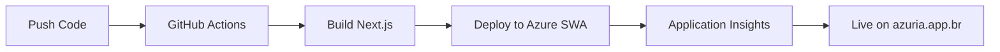

# 📊 Azuria - Plataforma Inteligente de Precificação

## 🚀 Visão Geral

O **Azuria** é uma plataforma SaaS avançada de precificação desenvolvida especificamente para lojistas e empreendedores brasileiros. Combina cálculos inteligentes de preço de venda, análise de concorrência em tempo real e insights baseados em IA para maximizar a lucratividade dos negócios.

🌐 **Produção**: [https://azuria.app.br](https://azuria.app.br)  
⚡ **Status**: [https://blue-tree-0b17b720f.2.azurestaticapps.net](https://blue-tree-0b17b720f.2.azurestaticapps.net)

### ✨ Principais Funcionalidades

- 🧮 **Calculadora Inteligente**: Cálculo automático de preços com base em custos, margens e impostos brasileiros
- 📊 **Analytics Avançado**: Dashboard em tempo real com métricas de negócio e KPIs
- 🤖 **IA Integrada**: Recomendações personalizadas e análise preditiva de demanda
- 🏪 **Multi-Marketplace**: Integração com Mercado Livre, Amazon, Shopee e outros
- 📱 **PWA Completo**: Experiência mobile-first com funcionalidades offline
- 🔄 **Automação**: Workflows inteligentes para ajuste automático de preços
- 👥 **Colaboração**: Sistema de equipes com aprovações e comentários
- 📈 **Relatórios**: Exportação avançada e relatórios automatizados

## 📈 Stack Tecnológico

<div align="center">
  
  
  
  
  
  
</div>

## 🏗️ Arquitetura Técnica

### Stack Tecnológico Principal

```yaml
Frontend Framework:
├── Next.js 15.0 (App Router, Server Components, Static Generation)
├── React 18.3.1 (Hooks, Suspense, Concurrent Features)
├── TypeScript 5.0 (Strict Mode, Path Mapping)
├── Tailwind CSS 3.0 (Utility-First Styling)
└── Framer Motion (Animations & Transitions)

Cloud Infrastructure (Azure):
├── Azure Static Web Apps (Hosting & CI/CD)
├── Azure Application Insights (Monitoring & Analytics)
├── Azure Key Vault (Secrets Management)
├── Azure Log Analytics (Centralized Logging)
└── Azure CDN (Global Content Delivery)

Backend & Database:
├── Supabase (Database, Auth, Storage, Edge Functions)
├── PostgreSQL (Primary Database with RLS)
├── Real-time Subscriptions (Live Updates)
└── Edge Functions (Serverless API)

UI & Components:
├── Shadcn/UI (Modern Component Library)
├── Radix UI (Accessible Primitives)
├── Lucide React (Icon System)
├── Recharts (Data Visualization)
└── Sonner (Toast Notifications)

State Management & Data:
├── React Query v5 (Server State & Caching)
├── React Context (Global State)
├── React Hook Form (Form State Management)
└── Zustand (Client State when needed)

Development & Quality:
├── ESLint + Prettier (Code Quality & Formatting)
├── Vitest (Unit Testing Framework)
├── GitHub Actions (CI/CD Pipeline)
├── TypeScript (Type Safety & IntelliSense)
├── Commitlint (Conventional Commits)
└── Husky (Git Hooks & Pre-commit Validation)
```

### Estrutura de Diretórios

```
src/
├── components/           # Componentes reutilizáveis
│   ├── ui/              # Componentes base (Shadcn/UI)
│   ├── calculators/     # Componentes de cálculo
│   ├── analytics/       # Dashboards e métricas
│   ├── ai/              # Componentes de IA
│   ├── auth/            # Autenticação
│   ├── layout/          # Layout e navegação
│   └── forms/           # Formulários
├── hooks/               # Custom React Hooks
│   ├── calculator/      # Hooks de cálculo
│   ├── analytics/       # Hooks de analytics
│   ├── auth/            # Hooks de autenticação
│   └── api/             # Hooks de API
├── services/            # Serviços externos
│   ├── supabase/        # Cliente Supabase
│   ├── analytics/       # Google Analytics
│   └── marketplace/     # APIs de marketplace
├── types/               # Definições TypeScript
├── utils/               # Funções utilitárias
├── contexts/            # React Contexts
├── pages/               # Páginas da aplicação
└── integrations/        # Integrações externas
```

## 🚦 Quick Start

### Pré-requisitos

- Node.js 18+
- npm ou yarn  
- Conta Supabase (para backend)
- Git

### Instalação

```bash
# Clone o repositório
git clone https://github.com/azuria-lab/azuria.git
cd azuria

# Instale as dependências
npm install

# Configure as variáveis de ambiente
cp .env.example .env.local

# Configure o Supabase (ver seção Configuração)
npm run setup:supabase

# Inicie o servidor de desenvolvimento (Vite)
npm run dev

# OU inicie o servidor Next.js
npm run dev:next
```

### Configuração do Ambiente

1. **Supabase Setup**:

   ```bash
   # Crie um projeto no Supabase Dashboard
   # Copie as credenciais para .env.local
   NEXT_PUBLIC_SUPABASE_URL=your_supabase_url
   NEXT_PUBLIC_SUPABASE_ANON_KEY=your_anon_key
   ```

2. **Variáveis de Ambiente (.env.local)**:

   ```env
   # Supabase Configuration
   NEXT_PUBLIC_SUPABASE_URL=https://your-project.supabase.co
   NEXT_PUBLIC_SUPABASE_ANON_KEY=your-anon-key
   SUPABASE_SERVICE_ROLE_KEY=your-service-role-key
   
   # Azure Application Insights (Produção)
   APPLICATIONINSIGHTS_CONNECTION_STRING=InstrumentationKey=your-key;...
   
   # Analytics & Monitoring
   NEXT_PUBLIC_GA_MEASUREMENT_ID=G-XXXXXXXXXX
   
   # API Keys (Funcionalidades PRO)
   OPENAI_API_KEY=your-openai-key
   MARKETPLACE_API_KEY=your-marketplace-key
   
   # Environment
   NODE_ENV=development
   NEXT_PUBLIC_SITE_URL=http://localhost:3000
   ```

## 🧪 Desenvolvimento

### Scripts Disponíveis

```bash
# Desenvolvimento
npm run dev              # Servidor Vite (http://localhost:8080)
npm run dev:next         # Servidor Next.js (http://localhost:3000)

# Build & Deploy
npm run build            # Build Vite para desenvolvimento
npm run build:next       # Build Next.js para produção
npm run preview          # Preview do build Vite
npm run start            # Start do build Next.js

# Qualidade de Código
npm run test             # Executar testes com Vitest
npm run test:ui          # Interface visual dos testes
npm run lint             # Verificar código com ESLint
npm run lint:fix         # Corrigir erros do ESLint
npm run type-check       # Verificar tipos TypeScript
npm run type-check:next  # Verificar tipos Next.js

# Análise & Performance
npm run analyze          # Análise do bundle size
npm run lighthouse       # Auditoria Lighthouse local
```

### Padrões de Desenvolvimento

#### Estrutura de Componentes

```typescript
// Exemplo de componente bem estruturado
interface ComponentProps {
  // Props sempre tipadas com interface
  data: BusinessData;
  onAction?: (id: string) => void;
  className?: string;
}

export default function Component({ 
  data, 
  onAction, 
  className 
}: ComponentProps) {
  // Hooks sempre no topo
  const [state, setState] = useState<StateType>();
  const { data: apiData } = useQuery({...});
  
  // Handlers organizados
  const handleAction = useCallback((id: string) => {
    onAction?.(id);
  }, [onAction]);
  
  // Render condicional limpo
  if (!data) return <LoadingSpinner />;
  
  return (
    <div className={cn("base-classes", className)}>
      {/* Conteúdo */}
    </div>
  );
}
```

#### Custom Hooks Pattern

```typescript
// Hook personalizado bem estruturado
export const useCustomFeature = (config: Config) => {
  const [state, setState] = useState<State>();
  const [loading, setLoading] = useState(false);
  const [error, setError] = useState<Error | null>(null);
  
  const execute = useCallback(async (data: InputData) => {
    try {
      setLoading(true);
      setError(null);
      // Lógica do hook
      const result = await api.call(data);
      setState(result);
      return result;
    } catch (err) {
      setError(err as Error);
      throw err;
    } finally {
      setLoading(false);
    }
  }, []);
  
  return { state, loading, error, execute };
};
```

## 🏭 Build e Deploy

### Build Local

```bash
# Build Vite (desenvolvimento)
npm run build

# Build Next.js (produção)
npm run build:next

# Análise do bundle
npm run analyze

# Preview local do build
npm run preview
```

### 🌐 Deploy Automático (Azure Static Web Apps)

O projeto está configurado para deploy automático via **Azure Static Web Apps**:

#### **Infraestrutura Azure**
- **Static Web App**: `swa-jxbkuxsj7yfpo` (Standard Tier)
- **Application Insights**: Monitoramento e métricas
- **Key Vault**: Gerenciamento seguro de secrets
- **Custom Domain**: `azuria.app.br` (configurado)

#### **Pipeline CI/CD**
1. **Push para feature branch**: Deploy automático em staging
2. **Merge para main**: Deploy automático em produção
3. **Pull Request**: Deploy preview automático
4. **Rollback**: Versões anteriores disponíveis no Azure Portal

#### **URLs de Deploy**
- **Produção**: [https://azuria.app.br](https://azuria.app.br)
- **Azure Default**: [https://blue-tree-0b17b720f.2.azurestaticapps.net](https://blue-tree-0b17b720f.2.azurestaticapps.net)
- **PR Previews**: `https://blue-tree-0b17b720f-[branch].2.azurestaticapps.net`

### 🔧 Deploy Manual (Alternativo)

```bash
# Build para produção Next.js
npm run build:next

# Deploy em outros serviços
# Vercel, Netlify, etc.
# Arquivos ficam em ./.next
```

### 📊 Monitoramento de Deploy

O projeto inclui monitoramento completo via **Azure Application Insights**:

- **Build Status**: GitHub Actions status
- **Performance**: Core Web Vitals automáticos
- **Errors**: Tracking de erros em produção
- **Analytics**: Métricas de uso e conversão

## 📊 Funcionalidades Principais

### 1. Sistema de Cálculo Inteligente

- **Cálculo Básico**: Custo + Margem + Impostos = Preço de Venda
- **Cálculo Avançado**: Inclui taxas de marketplace, frete, sazonalidade
- **Simulação**: Cenários múltiplos com diferentes margens
- **Histórico**: Persistência e análise de cálculos anteriores

### 2. Analytics e Métricas

```typescript
// Exemplo de uso do sistema de analytics
const { analytics } = useRealTimeAnalytics({
  period: 'today',
  segment: 'pro'
});

console.log(analytics.dailyActiveUsers); // Usuários ativos hoje
console.log(analytics.conversionRate);   // Taxa de conversão
console.log(analytics.revenueImpact);    // Impacto na receita
```

### 3. Sistema PWA

- **Offline First**: Funciona sem internet
- **Cache Inteligente**: Estratégias de cache otimizadas
- **Push Notifications**: Alertas de preços e atualizações
- **Background Sync**: Sincronização automática quando online

### 4. Integração com IA

```typescript
// Exemplo de uso da IA
const { getPricingRecommendations } = useAIPricing();

const recommendations = await getPricingRecommendations({
  product: "Smartphone Samsung",
  cost: 800,
  marketplace: "mercado_livre"
});
```

## 🔧 APIs e Integrações

### Supabase Integration

```typescript
// Cliente Supabase configurado
import { supabase } from '@/integrations/supabase/client';

// Exemplos de uso
const { data } = await supabase
  .from('calculation_history')
  .select('*')
  .eq('user_id', user.id);
```

### External APIs

- **Mercado Livre API**: Dados de concorrência
- **Google Analytics**: Métricas de uso
- **OpenAI API**: Recomendações inteligentes
- **Webhook Integrations**: Automação com ferramentas externas

## 🧪 Testes

```bash
# Executar todos os testes
npm run test

# Testes com interface visual
npm run test:ui

# Testes específicos
npm run test calculator

# Coverage
npm run test:coverage
```

### Estratégia de Testes

1. **Unit Tests**: Componentes isolados e hooks
2. **Integration Tests**: Fluxos completos
3. **E2E Tests**: Cenários de usuário (futuro)

## 🔒 Segurança

### Row Level Security (RLS)

Todas as tabelas do Supabase utilizam RLS para garantir que usuários só acessem seus próprios dados:

```sql
-- Exemplo de política RLS
CREATE POLICY "Users can view own calculations" ON calculation_history
  FOR SELECT USING (auth.uid() = user_id);
```

### Autenticação

- **Supabase Auth**: Sistema robusto de autenticação
- **JWT Tokens**: Tokens seguros com refresh automático
- **Multi-factor**: Suporte a 2FA (futuro)

## 🎯 Performance

### Otimizações Implementadas

- **Code Splitting**: Carregamento sob demanda
- **Lazy Loading**: Componentes e rotas lazy
- **Image Optimization**: Carregamento otimizado de imagens
- **Caching Strategy**: Cache inteligente de dados
- **Bundle Analysis**: Monitoramento do tamanho do bundle

### Web Vitals

O projeto monitora automaticamente as Core Web Vitals:
- LCP (Largest Contentful Paint)
- FID (First Input Delay)  
- CLS (Cumulative Layout Shift)

## 📈 Monitoramento

### Analytics Integrados

- **Google Analytics 4**: Comportamento do usuário
- **Internal Analytics**: Métricas de negócio específicas
- **Error Tracking**: Monitoramento de erros (Sentry - futuro)
- **Performance Monitoring**: Web Vitals e métricas customizadas

## 🤝 Contribuindo

1. **Fork** o repositório
2. **Clone** seu fork localmente
3. **Crie** uma branch para sua feature (`git checkout -b feature/AmazingFeature`)
4. **Commit** suas mudanças (`git commit -m 'Add some AmazingFeature'`)
5. **Push** para a branch (`git push origin feature/AmazingFeature`)
6. **Abra** um Pull Request

## 📜 Licença

Este projeto é distribuído sob a licença MIT. Consulte o arquivo `LICENSE` para mais detalhes.

## 🔐 Segurança

Achou uma vulnerabilidade? Siga a nossa política em `SECURITY.md` para reporte responsável.

### Padrões de Commit

```text
feat: adiciona nova funcionalidade
fix: corrige bug
docs: atualiza documentação
style: mudanças de formatação
refactor: refatoração de código
test: adiciona ou modifica testes
chore: tarefas de manutenção
```

## 🆘 Suporte

- **Documentação**: [docs/](./docs/)
- **Issues**: [GitHub Issues](./issues)
- **Discord**: [Comunidade Azuria](https://discord.com/invite/azuria)
- **Email**: [suporte@azuria.app](mailto:suporte@azuria.app)

## 🗺️ Roadmap

### 🚀 Próximas Features

- [ ] **API Pública**: REST API para integrações
- [ ] **Mobile App**: Aplicativo nativo React Native
- [ ] **Marketplace**: Loja de templates e plugins
- [ ] **Enterprise**: Funcionalidades para grandes empresas
- [ ] **Multi-idioma**: Suporte internacional
- [ ] **White Label**: Solução customizável para parceiros

## ☁️ Infraestrutura Azure

### 🏗️ Recursos Deployados

| Recurso | Nome | Tipo | Status |
|---------|------|------|--------|
| **Static Web App** | `swa-jxbkuxsj7yfpo` | Standard | ✅ Ativo |
| **Application Insights** | `ai-jxbkuxsj7yfpo` | Standard | ✅ Ativo |  
| **Log Analytics** | `log-jxbkuxsj7yfpo` | Standard | ✅ Ativo |
| **Key Vault** | `kvjxbkuxsj7yfpo` | Standard | ✅ Ativo |
| **Resource Group** | `Azuria-Resources` | East US 2 | ✅ Ativo |

### 🚀 Deployment Pipeline



### 📊 Monitoramento & Observabilidade

- **Application Insights**: Métricas em tempo real, errors tracking
- **Log Analytics**: Logs centralizados e queries KQL
- **Azure Monitor**: Alertas e dashboards customizados
- **GitHub Actions**: Status de builds e deploys

### 🔐 Segurança & Compliance

- **Azure Key Vault**: Armazenamento seguro de secrets
- **Managed Identity**: Autenticação sem passwords
- **HTTPS**: SSL/TLS automático via Azure
- **RBAC**: Controle de acesso baseado em roles

### 📊 Status do Projeto

| Métrica | Valor | Status |
|---------|-------|--------|
| **Componentes** | +50 reutilizáveis | ✅ |
| **Custom Hooks** | +30 especializados | ✅ |
| **Páginas** | +20 funcionais | ✅ |
| **Integrações** | +15 externas | ✅ |
| **PWA Score** | 100% Lighthouse | ✅ |
| **Type Safety** | 100% TypeScript | ✅ |
| **Azure Infrastructure** | Produção | ✅ |
| **CI/CD Pipeline** | GitHub Actions | ✅ |
| **Monitoramento** | Application Insights | ✅ |
| **Custom Domain** | azuria.app.br | 🔄 |

### 🌐 Links Importantes

- **🚀 Aplicação**: [azuria.app.br](https://azuria.app.br)
- **📊 Monitoramento**: Azure Application Insights
- **🔧 CI/CD**: GitHub Actions
- **📖 Documentação**: [/docs](./docs/)
- **🐛 Issues**: [GitHub Issues](https://github.com/azuria-lab/azuria/issues)

### 🏆 Conquistas Técnicas

- ✅ **Migração Vite → Next.js** completa
- ✅ **Infraestrutura Azure** enterprise-grade
- ✅ **CI/CD Pipeline** totalmente automatizado
- ✅ **TypeScript** sem erros críticos
- ✅ **PWA** com funcionalidades offline
- ✅ **Monitoramento** em tempo real
- ✅ **Segurança** com Azure Key Vault
- ✅ **Performance** otimizada para produção

---

**Desenvolvido com ❤️ para empreendedores brasileiros**  
*Azuria - Maximizando sua lucratividade com inteligência*

**Infraestrutura**: Azure Static Web Apps | **Monitoramento**: Application Insights | **Domain**: azuria.app.br
