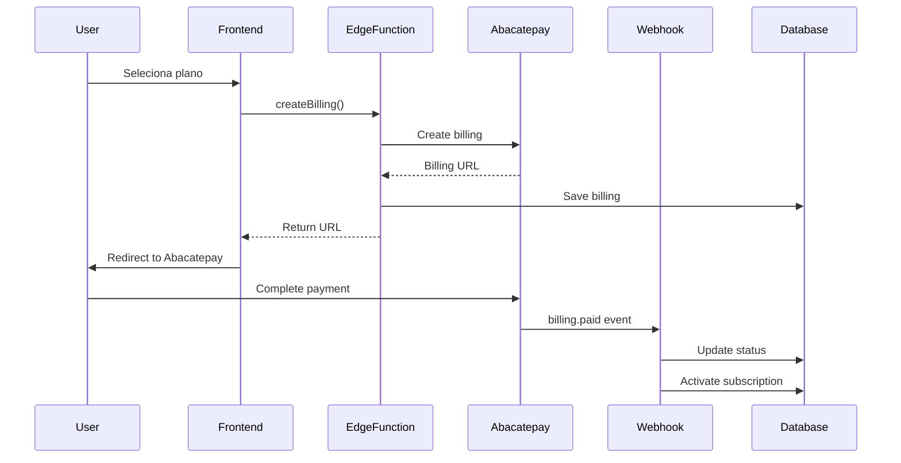

# Integração Abacatepay - Documentação

## Visão Geral

O Abacatepay é o gateway de pagamento principal do projeto Azuria, oferecendo suporte a PIX e Cartão de Crédito com uma API simples e descomplicada.

## Configuração

### 1. Variáveis de Ambiente

Adicione as seguintes variáveis ao seu arquivo `.env`:

```bash
# Abacatepay
ABACATEPAY_API_KEY=abacate_your_api_key_here
VITE_ABACATEPAY_DEV_MODE=true  # true para testes, false para produção
```

**Onde obter a API Key:**
1. Acesse https://www.abacatepay.com/app
2. Faça login ou crie uma conta
3. Vá em Configurações > API Keys
4. Copie sua API Key (começa com `abacate_`)

### 2. Configuração no Vercel

Para produção, configure as variáveis de ambiente no Vercel:

```bash
ABACATEPAY_API_KEY=abacate_prod_key
VITE_ABACATEPAY_DEV_MODE=false
```

### 3. Migração do Banco de Dados

Execute a migration para criar a tabela `abacatepay_billings`:

```bash
# Aplicar migration localmente
supabase db reset

# Ou aplicar apenas a migration específica
supabase migration up
```

### 4. Deploy das Edge Functions

```bash
# Deploy de todas as funções
supabase functions deploy abacatepay-create-billing
supabase functions deploy abacatepay-webhook
supabase functions deploy abacatepay-check-status

# Ou deploy de todas de uma vez
supabase functions deploy
```

### 5. Configurar Webhook no Abacatepay

1. Acesse o dashboard do Abacatepay
2. Vá em Configurações > Webhooks
3. Adicione a URL do webhook:
   ```
   https://[seu-projeto].supabase.co/functions/v1/abacatepay-webhook
   ```
4. Selecione os eventos:
   - `billing.paid`
   - `billing.refunded`
   - `billing.expired`

## Uso

### Frontend

#### Criar uma Cobrança

```tsx
import { useAbacatePay } from '@/hooks/useAbacatePay';

function MyComponent() {
  const { createBilling, isLoading } = useAbacatePay();

  const handleCheckout = async () => {
    await createBilling({
      planId: 'essencial',
      billingInterval: 'monthly',
      methods: ['PIX', 'CARD']
    });
  };

  return (
    <button onClick={handleCheckout} disabled={isLoading}>
      Assinar Plano
    </button>
  );
}
```

#### Componente de Checkout

```tsx
import { AbacatePayCheckout } from '@/components/payment/AbacatePayCheckout';

function PricingPage() {
  return (
    <AbacatePayCheckout
      planId="essencial"
      planName="Plano Essencial"
      billingInterval="monthly"
    />
  );
}
```

### Backend (Edge Functions)

#### Criar Cobrança

```bash
POST /functions/v1/abacatepay-create-billing
Authorization: Bearer <user-token>

{
  "planId": "essencial",
  "billingInterval": "monthly",
  "methods": ["PIX", "CARD"]
}
```

**Resposta:**
```json
{
  "success": true,
  "data": {
    "billingId": "bill_12345667",
    "url": "https://abacatepay.com/pay/bill_12345667",
    "amount": 5900
  },
  "error": null
}
```

#### Verificar Status

```bash
POST /functions/v1/abacatepay-check-status
Authorization: Bearer <user-token>

{
  "billingId": "bill_12345667"
}
```

**Resposta:**
```json
{
  "success": true,
  "data": {
    "status": "PAID",
    "amount": 5900,
    "paidAt": "2025-11-28T20:00:00.000Z"
  },
  "error": null
}
```

## Modo de Desenvolvimento

O Abacatepay possui um **Dev Mode** que permite testar pagamentos sem cobranças reais:

### Ativar Dev Mode

```bash
VITE_ABACATEPAY_DEV_MODE=true
```

### Simular Pagamento

1. Crie uma cobrança normalmente
2. Acesse o dashboard do Abacatepay
3. Vá em "Cobranças" > "Dev Mode"
4. Encontre sua cobrança e clique em "Simular Pagamento"
5. O webhook será disparado automaticamente

## Planos e Preços

### Plano Essencial
- **Mensal**: R$ 59,00 (`AZURIA-ESSENCIAL-MONTHLY`)
- **Anual**: R$ 590,00 (`AZURIA-ESSENCIAL-ANNUAL`)

### Plano Pro
- **Mensal**: R$ 149,00 (`AZURIA-PRO-MONTHLY`)
- **Anual**: R$ 1.490,00 (`AZURIA-PRO-ANNUAL`)

### Plano Enterprise
- **Customizado**: Entre em contato

## Fluxo de Pagamento



## Troubleshooting

### Erro: "Abacatepay API key not configured"

**Solução:** Verifique se a variável `ABACATEPAY_API_KEY` está configurada corretamente.

### Erro: "Billing not found"

**Solução:** Verifique se o `billing_id` está correto e se o billing foi criado com sucesso.

### Webhook não está sendo recebido

**Soluções:**
1. Verifique se a URL do webhook está correta no dashboard do Abacatepay
2. Verifique os logs da Edge Function: `supabase functions logs abacatepay-webhook`
3. Teste o webhook manualmente usando a função de teste do Abacatepay

### Pagamento não ativa a assinatura

**Soluções:**
1. Verifique os logs do webhook
2. Confirme que o evento `billing.paid` está sendo processado
3. Verifique se a tabela `subscriptions` existe e está acessível

## Recursos Adicionais

- [Documentação Oficial do Abacatepay](https://docs.abacatepay.com)
- [SDK Node.js](https://github.com/AbacatePay/abacatepay-nodejs-sdk)
- [Dashboard Abacatepay](https://www.abacatepay.com/app)
- [Suporte](mailto:[email protected])

## Migração de Stripe/MercadoPago

Para migrar de Stripe ou MercadoPago para Abacatepay:

1. **Mantenha os hooks antigos** - Eles ainda estão no código para referência
2. **Atualize a PricingPage** - Já configurada para usar Abacatepay
3. **Configure webhooks** - Configure os webhooks do Abacatepay
4. **Teste em dev mode** - Teste completamente antes de ir para produção
5. **Migre gradualmente** - Você pode manter ambos ativos temporariamente
