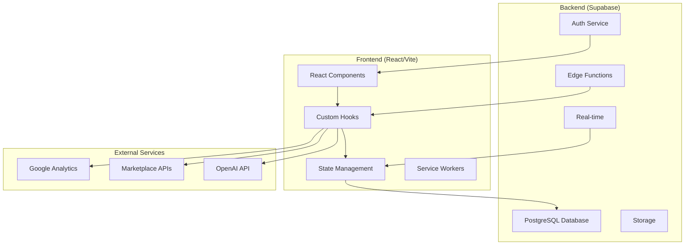
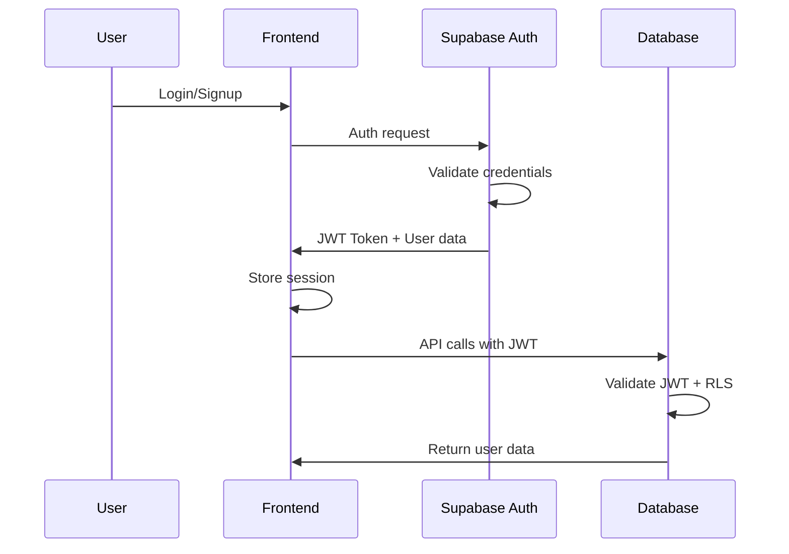
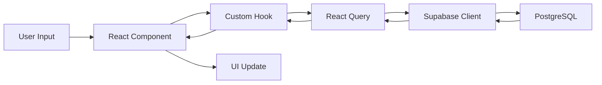

# 🏗️ Arquitetura do Precifica+

Este documento detalha a arquitetura técnica completa do Precifica+, incluindo decisões de design, padrões utilizados e estrutura do sistema.

## 📋 Índice

- [Visão Geral](#visão-geral)
- [Arquitetura Frontend](#arquitetura-frontend)
- [Arquitetura Backend](#arquitetura-backend)
- [Fluxo de Dados](#fluxo-de-dados)
- [Padrões de Design](#padrões-de-design)
- [Estrutura de Diretórios](#estrutura-de-diretórios)
- [Decisões Técnicas](#decisões-técnicas)
- [Segurança](#segurança)
- [Performance](#performance)
- [Escalabilidade](#escalabilidade)

## 🎯 Visão Geral

O Precifica+ é uma aplicação SaaS moderna construída com arquitetura JAMstack, combinando:

- **Frontend**: React SPA com TypeScript
- **Backend**: Supabase (BaaS)
- **Deploy**: Static hosting + CDN
- **PWA**: Service Workers para funcionalidade offline

### Arquitetura High-Level



## 🎨 Arquitetura Frontend

### Tecnologias Core

```typescript
// Stack principal
React 18.3.1          // UI Library com Concurrent Features
TypeScript 5.0        // Type Safety
Vite 5.0              // Build Tool & Dev Server
Tailwind CSS 3.0      // Styling Framework
React Query v5        // Server State Management
```

### Estrutura de Componentes

```
src/components/
├── ui/                 # Componentes base (Shadcn/UI)
│   ├── button.tsx     # Botão primitivo
│   ├── card.tsx       # Card primitivo
│   └── input.tsx      # Input primitivo
├── calculators/        # Componentes de cálculo
│   ├── SimpleCalculator.tsx
│   ├── ProCalculator.tsx
│   └── BatchCalculator.tsx
├── analytics/          # Dashboards e métricas
│   ├── AnalyticsDashboard.tsx
│   └── advanced/
│       ├── RealTimeMetrics.tsx
│       └── BusinessMetrics.tsx
├── ai/                # Componentes de IA
│   ├── AIChatbot.tsx
│   └── PriceOptimization.tsx
└── layout/            # Layout e navegação
    ├── Header.tsx
    ├── Footer.tsx
    └── Layout.tsx
```

### State Management Strategy

```typescript
// 1. Server State (React Query)
const { data, isLoading } = useQuery({
  queryKey: ['calculations', userId],
  queryFn: () => fetchCalculations(userId),
  staleTime: 5 * 60 * 1000, // 5 minutos
});

// 2. Client State (React Context + useState)
interface AppState {
  user: User | null;
  preferences: UserPreferences;
  theme: 'light' | 'dark';
}

// 3. Form State (React Hook Form)
const form = useForm<FormData>({
  resolver: zodResolver(schema),
  defaultValues: { cost: 0, margin: 30 }
});

// 4. URL State (React Router)
const [searchParams, setSearchParams] = useSearchParams();
```

### Hooks Architecture

```typescript
// Camadas de hooks customizados
src/hooks/
├── core/              # Hooks fundamentais
│   ├── useAuth.ts     # Autenticação
│   └── useLocalStorage.ts
├── calculator/        # Hooks de cálculo
│   ├── useCalculator.ts
│   └── useAdvancedCalculator.ts
├── analytics/         # Hooks de analytics
│   ├── useRealTimeAnalytics.ts
│   └── useBusinessMetrics.ts
└── api/               # Hooks de API
    ├── useSupabase.ts
    └── useMarketplaceAPI.ts
```

### Component Patterns

#### Compound Components

```typescript
// Calculator compound component
export const Calculator = {
  Root: CalculatorRoot,
  Input: CalculatorInput,
  Result: CalculatorResult,
  Actions: CalculatorActions
};

// Usage
<Calculator.Root>
  <Calculator.Input label="Custo" />
  <Calculator.Input label="Margem" />
  <Calculator.Result />
  <Calculator.Actions />
</Calculator.Root>
```

#### Render Props

```typescript
interface DataFetcherProps<T> {
  children: (data: T, loading: boolean, error: Error | null) => React.ReactNode;
  queryKey: string[];
  queryFn: () => Promise<T>;
}

function DataFetcher<T>({ children, queryKey, queryFn }: DataFetcherProps<T>) {
  const { data, isLoading, error } = useQuery({ queryKey, queryFn });
  return <>{children(data, isLoading, error)}</>;
}
```

#### Higher-Order Components

```typescript
// withAuth HOC
function withAuth<P extends object>(
  Component: React.ComponentType<P>
): React.ComponentType<P> {
  return function AuthenticatedComponent(props: P) {
    const { user, loading } = useAuth();
    
    if (loading) return <LoadingSpinner />;
    if (!user) return <LoginForm />;
    
    return <Component {...props} />;
  };
}
```

## 🗄️ Arquitetura Backend

### Supabase Stack

```sql
-- Database Schema
public.user_profiles          -- Perfis de usuário
public.calculation_history    -- Histórico de cálculos
public.business_settings      -- Configurações de negócio
public.automation_rules       -- Regras de automação
public.calculation_templates  -- Templates de cálculo

-- Row Level Security (RLS)
-- Todas as tabelas têm políticas RLS
-- Usuários só acessam seus próprios dados
```

### Edge Functions

```typescript
// Estrutura das Edge Functions
supabase/functions/
├── ai-pricing/               # IA para recomendações
│   └── index.ts
├── marketplace-sync/         # Sincronização com marketplaces
│   └── index.ts
├── report-generator/         # Geração de relatórios
│   └── index.ts
└── webhook-handler/          # Webhooks externos
    └── index.ts
```

### Authentication Flow



### Real-time Architecture

```typescript
// Real-time subscriptions
const channel = supabase
  .channel('calculations')
  .on('postgres_changes', {
    event: 'INSERT',
    schema: 'public',
    table: 'calculation_history',
    filter: `user_id=eq.${userId}`
  }, (payload) => {
    // Update UI in real-time
    queryClient.invalidateQueries(['calculations']);
  })
  .subscribe();
```

## 🔀 Fluxo de Dados

### Data Flow Diagram



### State Synchronization

```typescript
// 1. User types in calculator
const handleInputChange = (field: string, value: number) => {
  setInput(field, value);        // Local state
  debouncedSave(inputs);         // Auto-save to DB
};

// 2. Calculation trigger
const handleCalculate = async () => {
  const result = await calculate(inputs);
  setResult(result);             // Local state
  await saveCalculation(result); // Persist to DB
  trackEvent('calculation', result); // Analytics
};

// 3. Real-time sync
useEffect(() => {
  const subscription = supabase
    .channel('user-calculations')
    .on('postgres_changes', {
      event: 'INSERT',
      schema: 'public',
      table: 'calculation_history'
    }, (payload) => {
      // Update other tabs/devices
      queryClient.setQueryData(['calculations'], (old) => [
        payload.new,
        ...old
      ]);
    })
    .subscribe();
    
  return () => subscription.unsubscribe();
}, []);
```

## 🎨 Padrões de Design

### Atomic Design

```
Atoms (ui/)
├── Button
├── Input  
├── Label
└── Icon

Molecules (composed components)
├── InputField (Label + Input)
├── SearchBox (Input + Button)
└── PriceDisplay (Icon + Text)

Organisms (feature components)
├── CalculatorForm
├── ResultsPanel
└── HistoryList

Templates (page layouts)
├── DashboardLayout
├── CalculatorLayout
└── AuthLayout

Pages (routed pages)
├── HomePage
├── CalculatorPage
└── AnalyticsPage
```

### Container/Presenter Pattern

```typescript
// Container (logic)
function CalculatorContainer() {
  const { inputs, result, calculate, loading } = useCalculator();
  
  return (
    <CalculatorPresenter 
      inputs={inputs}
      result={result}
      onCalculate={calculate}
      loading={loading}
    />
  );
}

// Presenter (UI)
interface CalculatorPresenterProps {
  inputs: CalculatorInputs;
  result: CalculationResult | null;
  onCalculate: () => void;
  loading: boolean;
}

function CalculatorPresenter({ 
  inputs, 
  result, 
  onCalculate, 
  loading 
}: CalculatorPresenterProps) {
  return (
    <div>
      {/* Pure UI components */}
    </div>
  );
}
```

### Command Pattern (Actions)

```typescript
// Action interface
interface Action {
  execute(): Promise<void>;
  undo?(): Promise<void>;
}

// Concrete actions
class CalculatePriceAction implements Action {
  constructor(
    private inputs: CalculatorInputs,
    private setResult: (result: CalculationResult) => void
  ) {}
  
  async execute() {
    const result = await calculatePrice(this.inputs);
    this.setResult(result);
  }
}

class SaveCalculationAction implements Action {
  constructor(private calculation: CalculationResult) {}
  
  async execute() {
    await supabase
      .from('calculation_history')
      .insert(this.calculation);
  }
}

// Action dispatcher
class ActionDispatcher {
  async dispatch(action: Action) {
    try {
      await action.execute();
    } catch (error) {
      console.error('Action failed:', error);
      if (action.undo) {
        await action.undo();
      }
    }
  }
}
```

### Observer Pattern (Events)

```typescript
// Event system
class EventEmitter {
  private listeners: { [key: string]: Function[] } = {};
  
  on(event: string, callback: Function) {
    if (!this.listeners[event]) {
      this.listeners[event] = [];
    }
    this.listeners[event].push(callback);
  }
  
  emit(event: string, data: any) {
    if (this.listeners[event]) {
      this.listeners[event].forEach(callback => callback(data));
    }
  }
}

// Usage
const eventBus = new EventEmitter();

// Subscribe to calculation events
eventBus.on('calculation:completed', (result) => {
  // Track analytics
  trackEvent('calculation_completed', result);
  
  // Update UI
  toast.success('Cálculo realizado com sucesso!');
});

// Emit events
eventBus.emit('calculation:completed', calculationResult);
```

## 📁 Estrutura de Diretórios

### Detailed Structure

```
precifica-plus/
├── public/                 # Assets estáticos
│   ├── manifest.json      # PWA manifest
│   ├── sw.js             # Service Worker
│   └── icons/            # Ícones da aplicação
├── src/
│   ├── components/       # Componentes React
│   │   ├── ui/          # Componentes base
│   │   ├── calculators/ # Calculadoras
│   │   ├── analytics/   # Analytics
│   │   ├── ai/          # IA Components
│   │   └── layout/      # Layout
│   ├── hooks/           # Custom hooks
│   │   ├── calculator/  # Hooks de cálculo
│   │   ├── analytics/   # Hooks de analytics
│   │   ├── auth/        # Hooks de auth
│   │   └── api/         # Hooks de API
│   ├── services/        # Serviços externos
│   │   ├── supabase/    # Cliente Supabase
│   │   ├── analytics/   # Google Analytics
│   │   └── ai/          # OpenAI integration
│   ├── utils/           # Funções utilitárias
│   │   ├── calculator/  # Utils de cálculo
│   │   ├── format/      # Formatação
│   │   └── validation/  # Validação
│   ├── types/           # TypeScript types
│   │   ├── api.ts       # Tipos de API
│   │   ├── calculator.ts # Tipos do calculador
│   │   └── user.ts      # Tipos de usuário
│   ├── contexts/        # React contexts
│   │   ├── AuthContext.tsx
│   │   └── ThemeContext.tsx
│   ├── pages/           # Páginas da aplicação
│   │   ├── HomePage.tsx
│   │   ├── CalculatorPage.tsx
│   │   └── AnalyticsPage.tsx
│   ├── styles/          # Estilos globais
│   │   └── globals.css
│   └── integrations/    # Integrações
│       └── supabase/    # Config Supabase
├── supabase/            # Configuração Supabase
│   ├── migrations/      # Database migrations
│   ├── functions/       # Edge functions
│   └── config.toml      # Configuração
├── docs/                # Documentação
│   ├── README.md
│   ├── API_REFERENCE.md
│   ├── CONTRIBUTING.md
│   └── DEPLOYMENT.md
└── tests/               # Testes
    ├── unit/
    ├── integration/
    └── e2e/
```

## 🤔 Decisões Técnicas

### Por que React + TypeScript?

**Vantagens:**
- Type safety reduz bugs em produção
- Ecossistema maduro e estável
- Performance excelente com Concurrent Features
- Boa experiência de desenvolvimento

**Alternativas consideradas:**
- Vue.js: Boa opção, mas React tem melhor suporte para PWA
- Angular: Muito pesado para uma SPA
- Svelte: Muito novo, ecossistema limitado

### Por que Vite?

**Vantagens:**
- Dev server extremamente rápido (HMR < 100ms)
- Build otimizado com Rollup
- Plugin ecosystem robusto
- Suporte nativo ao TypeScript

**Alternativas:**
- Create React App: Muito lento, pouco configurável
- Webpack: Complexo de configurar
- Parcel: Bom, mas menos flexível

### Por que Supabase?

**Vantagens:**
- PostgreSQL completo (não NoSQL limitado)
- Real-time subscriptions built-in
- Row Level Security (RLS)
- Edge Functions para lógica customizada
- Self-hosted option disponível

**Alternativas:**
- Firebase: NoSQL, vendor lock-in
- AWS Amplify: Complexo, caro
- Backend próprio: Muito trabalho de setup

### Por que Tailwind CSS?

**Vantagens:**
- Utility-first permite desenvolvimento rápido
- Bundle pequeno com purging
- Design system consistente
- Não há CSS conflicts

**Alternativas:**
- Styled Components: Runtime overhead
- CSS Modules: Verbose, menos flexível
- Material-UI: Pesado, difícil de customizar

## 🔒 Segurança

### Authentication & Authorization

```typescript
// JWT Token validation
const validateToken = (token: string) => {
  try {
    const decoded = jwt.verify(token, supabaseSecret);
    return decoded;
  } catch (error) {
    throw new Error('Invalid token');
  }
};

// Row Level Security
CREATE POLICY "Users can only see own data" ON calculation_history
  FOR ALL USING (auth.uid() = user_id);
```

### Data Protection

```typescript
// Input sanitization
const sanitizeInput = (input: string) => {
  return input
    .replace(/<script\b[^<]*(?:(?!<\/script>)<[^<]*)*<\/script>/gi, '')
    .trim();
};

// SQL injection prevention (Supabase handles this)
const safeQuery = supabase
  .from('calculations')
  .select('*')
  .eq('user_id', userId); // Parameterized query
```

### HTTPS & Headers

```typescript
// Security headers (configured in deployment)
const securityHeaders = {
  'X-Frame-Options': 'DENY',
  'X-Content-Type-Options': 'nosniff',
  'X-XSS-Protection': '1; mode=block',
  'Strict-Transport-Security': 'max-age=31536000; includeSubDomains',
  'Content-Security-Policy': "default-src 'self'; script-src 'self' 'unsafe-inline'"
};
```

## ⚡ Performance

### Bundle Optimization

```typescript
// Code splitting
const LazyCalculator = lazy(() => import('./Calculator'));
const LazyAnalytics = lazy(() => import('./Analytics'));

// Route-based splitting
const routes = [
  {
    path: '/calculator',
    component: lazy(() => import('./pages/CalculatorPage'))
  },
  {
    path: '/analytics', 
    component: lazy(() => import('./pages/AnalyticsPage'))
  }
];
```

### Caching Strategy

```typescript
// React Query caching
const defaultQueryOptions = {
  staleTime: 5 * 60 * 1000,      // 5 minutes
  cacheTime: 10 * 60 * 1000,     // 10 minutes
  retry: 3,
  refetchOnWindowFocus: false
};

// Service Worker caching
const CACHE_STRATEGIES = {
  static: 'cache-first',         // CSS, JS, images
  api: 'network-first',          // API calls
  pages: 'stale-while-revalidate' // HTML pages
};
```

### Memory Management

```typescript
// Cleanup subscriptions
useEffect(() => {
  const subscription = supabase
    .channel('realtime')
    .subscribe();
    
  return () => {
    subscription.unsubscribe(); // Prevent memory leaks
  };
}, []);

// Debounced inputs
const debouncedSave = useMemo(
  () => debounce(saveToDatabase, 500),
  []
);
```

## 📈 Escalabilidade

### Horizontal Scaling

```typescript
// Stateless components
// Todas as funcionalidades são stateless
// Estado armazenado no Supabase ou localStorage

// CDN Distribution
// Assets estáticos servidos via CDN
// Edge locations para menor latência

// Database scaling (Supabase)
// Read replicas automáticas
// Connection pooling built-in
```

### Vertical Scaling

```typescript
// Lazy loading
const optimizeImages = {
  loading: 'lazy',
  sizes: '(max-width: 768px) 100vw, 50vw',
  quality: 85
};

// Virtual scrolling para listas grandes
const VirtualizedList = ({ items }) => {
  return (
    <FixedSizeList
      height={400}
      itemCount={items.length}
      itemSize={50}
    >
      {({ index, style }) => (
        <div style={style}>
          {items[index]}
        </div>
      )}
    </FixedSizeList>
  );
};
```

### Future Scalability

```typescript
// Microservices ready
// Edge Functions podem ser extraídas para microserviços
// Database pode ser particionada por tenant

// Multi-tenant architecture
// Suporte a múltiplas organizações
// Isolamento de dados por tenant

// API versioning
const API_VERSION = 'v1';
const apiUrl = `${baseUrl}/${API_VERSION}/calculations`;
```

---

## 🔄 Evolução da Arquitetura

### Fase Atual (v1.0)

- ✅ SPA com React + TypeScript
- ✅ Supabase como BaaS
- ✅ PWA completo
- ✅ Real-time features

### Próximas Fases

#### v1.5 - Melhorias
- [ ] Server-Side Rendering (Next.js)
- [ ] Advanced caching strategies
- [ ] Performance optimizations

#### v2.0 - Expansão
- [ ] Mobile app (React Native)
- [ ] Desktop app (Electron)
- [ ] API pública

#### v3.0 - Enterprise
- [ ] Multi-tenant SaaS
- [ ] Microservices architecture
- [ ] Self-hosted option

Esta arquitetura foi projetada para ser flexível e escalável, permitindo evolução gradual conforme o produto cresce.
