# 📊 Diagramas do Azuria

Este documento contém diagramas de arquitetura, fluxos e estrutura do Azuria. Os diagramas estão em formato **Mermaid**, que pode ser renderizado no GitHub, GitLab e em várias ferramentas de documentação.

---

## 🏗️ Arquitetura Geral

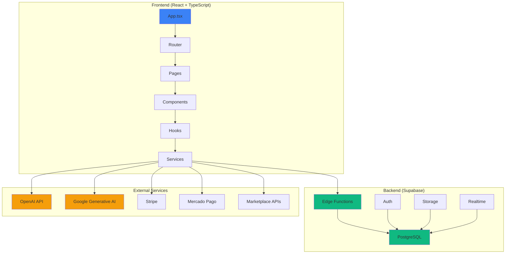

---

## 🔄 Fluxo de Dados - Calculadora Avançada

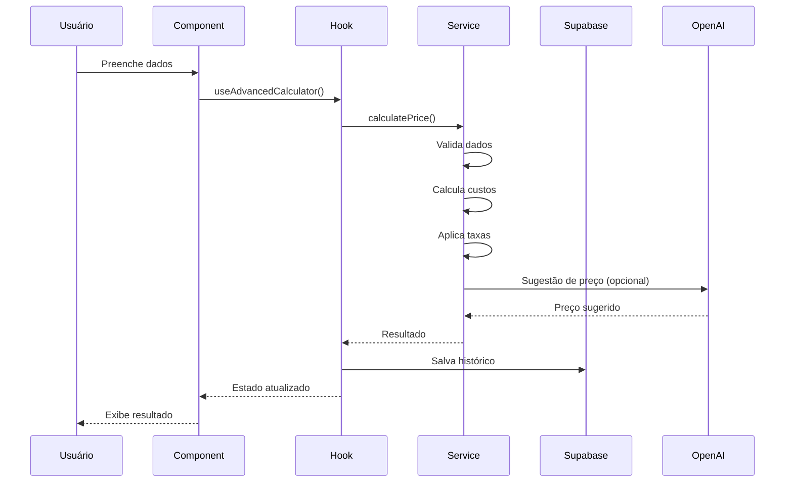

---

## 🧠 Fluxo de IA - Azuria AI

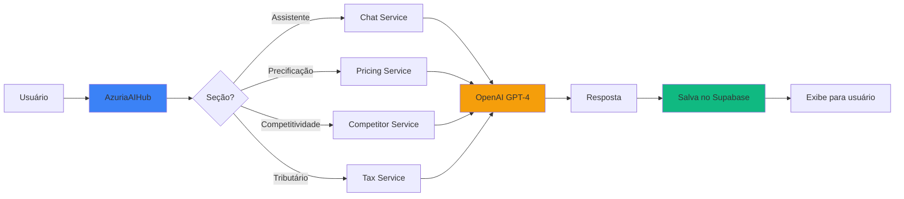

---

## 🏪 Fluxo Multi-Marketplace

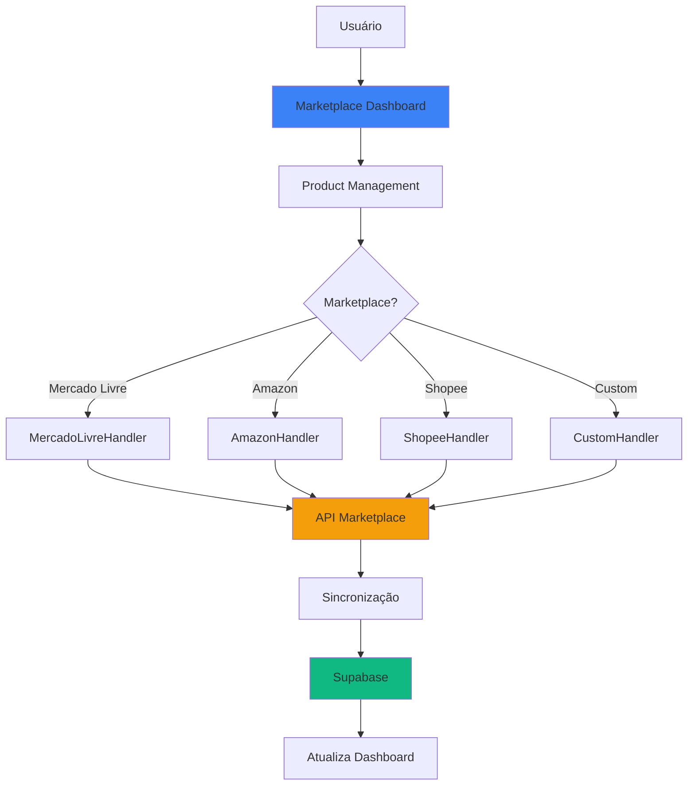

---

## 💳 Fluxo de Assinatura

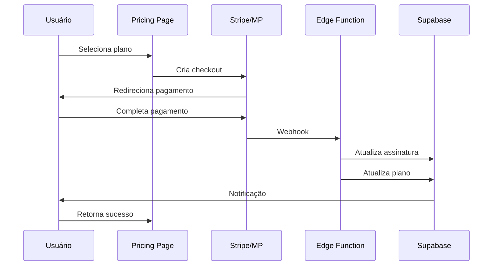

---

## 🏛️ Estrutura de Domínios (DDD)

```mermaid
graph TB
    subgraph "Domain: auth"
        A1[AuthContext]
        A2[AuthService]
        A3[AuthHooks]
    end
    
    subgraph "Domain: calculator"
        B1[CalculatorContext]
        B2[CalculatorService]
        B3[CalculatorHooks]
    end
    
    subgraph "Domain: marketplace"
        C1[MarketplaceContext]
        C2[MarketplaceService]
        C3[MarketplaceHooks]
    end
    
    subgraph "Domain: analytics"
        D1[AnalyticsContext]
        D2[AnalyticsService]
        D3[AnalyticsHooks]
    end
    
    subgraph "Domain: subscription"
        E1[SubscriptionService]
        E2[SubscriptionHooks]
    end
    
    subgraph "Shared"
        F1[Shared Types]
        F2[Shared Utils]
        F3[Shared Hooks]
    end
    
    A1 --> F1
    B1 --> F1
    C1 --> F1
    D1 --> F1
    E1 --> F1
    
    style A1 fill:#3b82f6
    style B1 fill:#3b82f6
    style C1 fill:#3b82f6
    style D1 fill:#3b82f6
    style F1 fill:#10b981
```

---

## 🔐 Fluxo de Autenticação

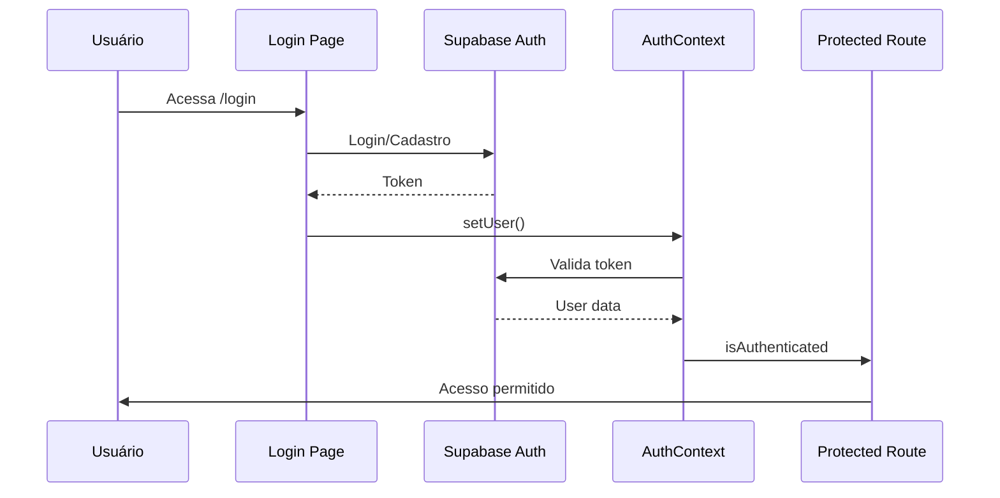

---

## 📊 Fluxo de Analytics

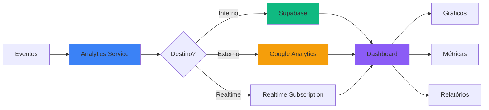

---

## ⚙️ Fluxo de Automação

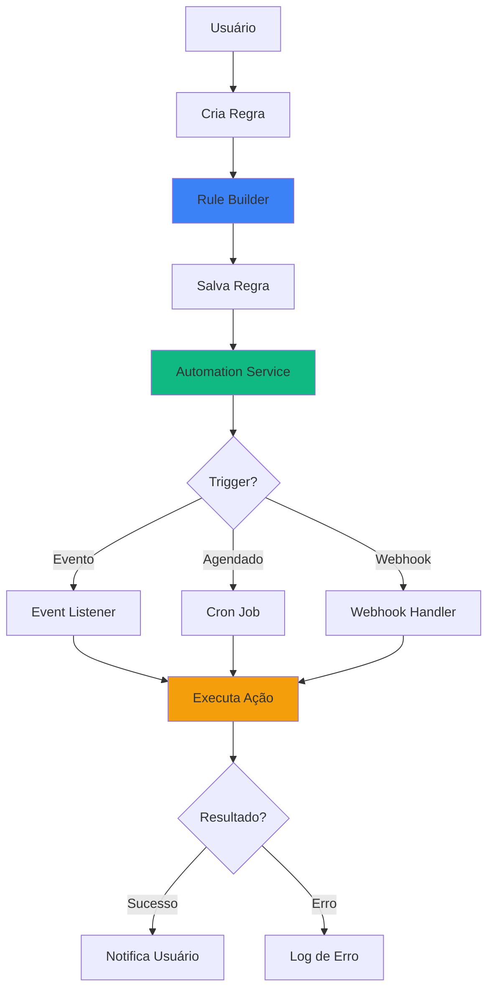

---

## 🔄 Fluxo de Colaboração

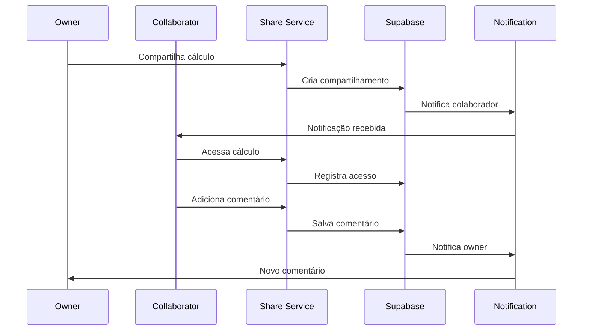

---

## 📦 Estrutura de Componentes

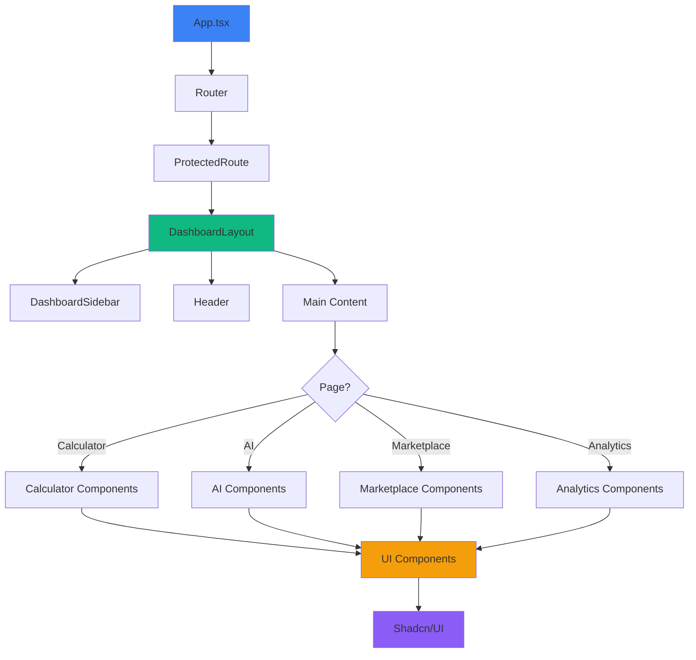

---

## 🚀 Fluxo de Deploy

```mermaid
graph LR
    A[Git Push] --> B[GitHub]
    B --> C[GitHub Actions]
    C --> D{Tests?}
    D -->|Pass| E[Build]
    D -->|Fail| F[Notify]
    E --> G[Vercel]
    G --> H[Deploy]
    H --> I[Production]
    
    style A fill:#3b82f6
    style C fill:#10b981
    style G fill:#000000
    style I fill:#f59e0b
```

---

## 📝 Como Usar

### No GitHub/GitLab

Os diagramas Mermaid são renderizados automaticamente quando você visualiza o arquivo `.md` no GitHub ou GitLab.

### Em Outras Ferramentas

1. **VS Code**: Instale a extensão "Markdown Preview Mermaid Support"
2. **Documentação Online**: Use ferramentas como [Mermaid Live Editor](https://mermaid.live/)
3. **Exportar**: Use ferramentas online para exportar como PNG/SVG

### Editar Diagramas

1. Edite o código Mermaid neste arquivo
2. Teste no [Mermaid Live Editor](https://mermaid.live/)
3. Commit as mudanças

---

**Última atualização:** Janeiro 2025

