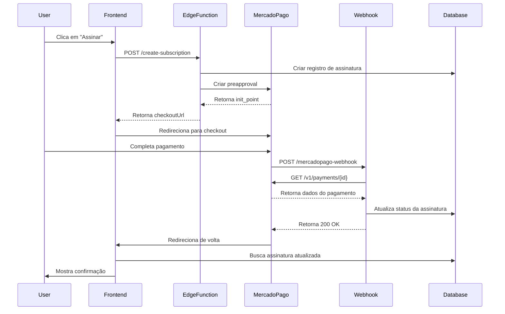

# Exemplos de Integração - Edge Functions

Este documento mostra como usar as Edge Functions do Mercado Pago no código frontend.

## 🔗 URLs das Edge Functions

```typescript
const EDGE_FUNCTIONS_BASE_URL = 'https://crpzkppsriranmeumfqs.supabase.co/functions/v1';

export const EDGE_FUNCTIONS = {
  createSubscription: `${EDGE_FUNCTIONS_BASE_URL}/create-subscription`,
  createPaymentPreference: `${EDGE_FUNCTIONS_BASE_URL}/create-payment-preference`,
  cancelSubscription: `${EDGE_FUNCTIONS_BASE_URL}/cancel-subscription`,
  webhook: `${EDGE_FUNCTIONS_BASE_URL}/mercadopago-webhook`,
} as const;
```

## 📝 Atualizar mercadopago-client.ts

Substitua as implementações atuais pelas chamadas para as Edge Functions:

```typescript
// src/lib/mercadopago-client.ts

import { supabase } from '@/integrations/supabase/client';

const EDGE_FUNCTIONS_BASE_URL = 'https://crpzkppsriranmeumfqs.supabase.co/functions/v1';

/**
 * Cria uma assinatura recorrente no Mercado Pago
 */
export async function createSubscription(
  planType: 'essencial' | 'pro' | 'enterprise',
  userId: string
): Promise<{ checkoutUrl: string; subscriptionId: string }> {
  // Obter token de autenticação
  const { data: { session }, error: sessionError } = await supabase.auth.getSession();
  
  if (sessionError || !session) {
    throw new Error('User not authenticated');
  }

  const response = await fetch(`${EDGE_FUNCTIONS_BASE_URL}/create-subscription`, {
    method: 'POST',
    headers: {
      'Authorization': `Bearer ${session.access_token}`,
      'Content-Type': 'application/json',
    },
    body: JSON.stringify({
      planId: planType,
      billingInterval: 'monthly', // ou 'annual'
    }),
  });

  if (!response.ok) {
    const error = await response.json();
    throw new Error(error.error || 'Failed to create subscription');
  }

  const result = await response.json();
  return result.data;
}

/**
 * Cria uma preferência de pagamento único no Mercado Pago
 */
export async function createPaymentPreference(
  planType: 'essencial' | 'pro' | 'enterprise',
  userId: string
): Promise<{ checkoutUrl: string; preferenceId: string }> {
  const { data: { session }, error: sessionError } = await supabase.auth.getSession();
  
  if (sessionError || !session) {
    throw new Error('User not authenticated');
  }

  const response = await fetch(`${EDGE_FUNCTIONS_BASE_URL}/create-payment-preference`, {
    method: 'POST',
    headers: {
      'Authorization': `Bearer ${session.access_token}`,
      'Content-Type': 'application/json',
    },
    body: JSON.stringify({
      planId: planType,
      billingInterval: 'monthly', // ou 'annual'
    }),
  });

  if (!response.ok) {
    const error = await response.json();
    throw new Error(error.error || 'Failed to create payment preference');
  }

  const result = await response.json();
  return result.data;
}

/**
 * Cancela uma assinatura no Mercado Pago
 */
export async function cancelMPSubscription(
  subscriptionId: string
): Promise<void> {
  const { data: { session }, error: sessionError } = await supabase.auth.getSession();
  
  if (sessionError || !session) {
    throw new Error('User not authenticated');
  }

  const response = await fetch(`${EDGE_FUNCTIONS_BASE_URL}/cancel-subscription`, {
    method: 'POST',
    headers: {
      'Authorization': `Bearer ${session.access_token}`,
      'Content-Type': 'application/json',
    },
    body: JSON.stringify({
      subscriptionId,
    }),
  });

  if (!response.ok) {
    const error = await response.json();
    throw new Error(error.error || 'Failed to cancel subscription');
  }
}
```

## 🎯 Usar no Hook useMercadoPago

O hook `useMercadoPago.tsx` já está preparado para usar essas funções:

```typescript
// src/hooks/useMercadoPago.tsx

import { createSubscription, createPaymentPreference, cancelMPSubscription } from '@/lib/mercadopago-client';

// As funções já estão sendo usadas corretamente:
// - createSubscriptionMutation chama createSubscription()
// - createPreferenceMutation chama createPaymentPreference()
// - cancelSubscriptionMutation chama cancelMPSubscription()
```

## 🔔 Webhook - Processamento Automático

O webhook é chamado automaticamente pelo Mercado Pago quando há mudanças no status do pagamento.

**Você não precisa fazer nada no frontend** - o webhook processa tudo automaticamente:

1. ✅ Pagamento aprovado → Ativa assinatura
2. ⏳ Pagamento pendente → Marca como incompleto
3. ❌ Pagamento rejeitado → Marca como expirado
4. 💰 Reembolso → Cancela assinatura

## 🧪 Testar Localmente

### 1. Configurar Supabase Local

```bash
# Inicializar Supabase local
supabase init

# Iniciar serviços locais
supabase start

# Deploy funções localmente
supabase functions serve
```

### 2. Atualizar URLs para local

```typescript
// Para desenvolvimento local
const EDGE_FUNCTIONS_BASE_URL = 'http://localhost:54321/functions/v1';
```

### 3. Testar com curl

```bash
# Obter token de autenticação
# (faça login no app e copie o token do localStorage ou DevTools)

export TOKEN="seu_token_aqui"

# Testar criação de assinatura
curl -X POST \
  'http://localhost:54321/functions/v1/create-subscription' \
  -H "Authorization: Bearer $TOKEN" \
  -H 'Content-Type: application/json' \
  -d '{
    "planId": "essencial",
    "billingInterval": "monthly"
  }'
```

## 🎨 Exemplo de Componente de Checkout

```tsx
// src/components/payment/CheckoutButton.tsx

import { useMercadoPago } from '@/hooks/useMercadoPago';
import { Button } from '@/components/ui/button';

export function CheckoutButton({ planId }: { planId: 'essencial' | 'pro' | 'enterprise' }) {
  const { createCheckout, isLoading } = useMercadoPago();

  const handleCheckout = async () => {
    await createCheckout(planId, 'subscription'); // ou 'preference'
  };

  return (
    <Button 
      onClick={handleCheckout} 
      disabled={isLoading}
      size="lg"
      className="w-full"
    >
      {isLoading ? 'Processando...' : 'Assinar Agora'}
    </Button>
  );
}
```

## 🔄 Fluxo Completo de Pagamento



## 📊 Monitorar Status da Assinatura

```typescript
// src/hooks/useSubscription.ts já faz isso automaticamente

const { subscription, isLoading } = useSubscription();

// Status possíveis:
// - 'active': Assinatura ativa
// - 'canceled': Cancelada pelo usuário
// - 'past_due': Pagamento atrasado
// - 'trialing': Em período de teste
// - 'incomplete': Aguardando pagamento
// - 'incomplete_expired': Pagamento expirou
```

## 🎉 Pronto para Produção!

Quando estiver pronto para produção:

1. ✅ Deploy das Edge Functions no Supabase
2. ✅ Configure MERCADOPAGO_ACCESS_TOKEN com credenciais de produção
3. ✅ Configure webhook no painel do Mercado Pago
4. ✅ Atualize FRONTEND_URL para seu domínio
5. ✅ Teste com pagamento real (valor baixo)
6. ✅ Monitore logs das Edge Functions

---

**Dúvidas?** Consulte [EDGE_FUNCTIONS_DEPLOY.md](./EDGE_FUNCTIONS_DEPLOY.md)
