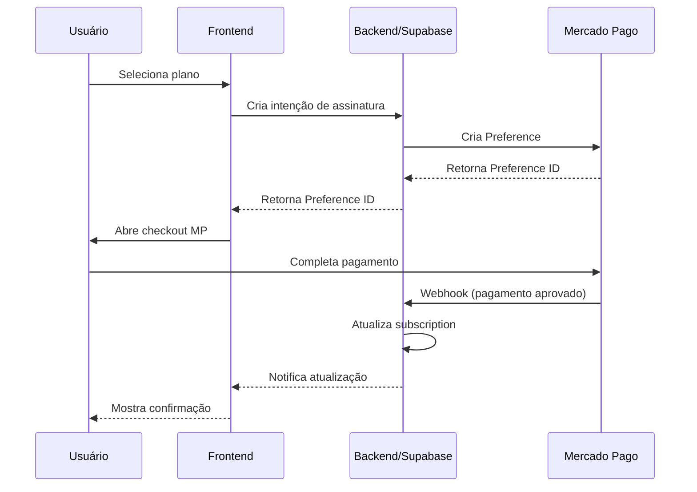

# Guia de Integração - Mercado Pago

## 📋 Visão Geral

Este guia detalha como integrar o sistema de assinaturas do Azuria com o Mercado Pago para processar pagamentos recorrentes.

---

## 🔑 1. Configuração Inicial

### 1.1 Criar Conta no Mercado Pago

1. Acesse: https://www.mercadopago.com.br/developers
2. Crie uma conta de desenvolvedor
3. Acesse o Dashboard de desenvolvedores

### 1.2 Obter Credenciais

**Modo Teste (Desenvolvimento):**
- Access Token: `TEST-*****`
- Public Key: `TEST-*****`

**Modo Produção:**
- Access Token: `APP_USR-*****`
- Public Key: `APP_USR-*****`

### 1.3 Configurar Variáveis de Ambiente

Adicione ao arquivo `.env.local`:

```env
# Mercado Pago - Teste
VITE_MERCADOPAGO_PUBLIC_KEY=TEST-your-public-key
MERCADOPAGO_ACCESS_TOKEN=TEST-your-access-token

# Mercado Pago - Produção
# VITE_MERCADOPAGO_PUBLIC_KEY=APP_USR-your-public-key
# MERCADOPAGO_ACCESS_TOKEN=APP_USR-your-access-token

# Webhook
VITE_WEBHOOK_URL=https://seu-dominio.com/api/webhooks/mercadopago
```

---

## 📦 2. Instalação de Dependências

```bash
npm install mercadopago
npm install @mercadopago/sdk-react
```

---

## 🏗️ 3. Estrutura da Integração

### 3.1 Planos no Mercado Pago

Os planos devem ser criados manualmente no painel do Mercado Pago ou via API:

**Plano Essencial:**
- ID: `2c9380848a1234567890abcd`
- Nome: `Azuria - Plano Essencial`
- Valor: R$ 59,00/mês
- Frequência: Mensal

**Plano Pro:**
- ID: `2c9380848a1234567890abce`
- Nome: `Azuria - Plano Pro`
- Valor: R$ 119,00/mês
- Frequência: Mensal

**Plano Enterprise:**
- Personalizado, negociado diretamente

### 3.2 Fluxo de Assinatura



---

## 🔧 4. Implementação Backend (Supabase Edge Functions)

### 4.1 Criar Supabase Edge Function

```bash
supabase functions new mercadopago-webhook
```

### 4.2 Código da Edge Function

Arquivo: `supabase/functions/mercadopago-webhook/index.ts`

```typescript
import { serve } from 'https://deno.land/std@0.168.0/http/server.ts'
import { createClient } from 'https://esm.sh/@supabase/supabase-js@2'

const MERCADOPAGO_ACCESS_TOKEN = Deno.env.get('MERCADOPAGO_ACCESS_TOKEN')!
const SUPABASE_URL = Deno.env.get('SUPABASE_URL')!
const SUPABASE_SERVICE_ROLE_KEY = Deno.env.get('SUPABASE_SERVICE_ROLE_KEY')!

serve(async (req) => {
  try {
    // Verificar assinatura do webhook
    const signature = req.headers.get('x-signature')
    const requestId = req.headers.get('x-request-id')
    
    if (!signature || !requestId) {
      return new Response('Unauthorized', { status: 401 })
    }

    const body = await req.json()
    
    // Processar diferentes tipos de eventos
    switch (body.type) {
      case 'payment':
        await handlePayment(body.data.id)
        break
      
      case 'subscription_preapproval':
        await handleSubscription(body.data.id)
        break
      
      case 'subscription_preapproval_updated':
        await handleSubscriptionUpdate(body.data.id)
        break
      
      default:
        console.log('Evento não tratado:', body.type)
    }

    return new Response(JSON.stringify({ received: true }), {
      headers: { 'Content-Type': 'application/json' },
      status: 200,
    })
  } catch (error) {
    console.error('Erro no webhook:', error)
    return new Response(JSON.stringify({ error: error.message }), {
      headers: { 'Content-Type': 'application/json' },
      status: 500,
    })
  }
})

async function handlePayment(paymentId: string) {
  // Buscar dados do pagamento no MP
  const response = await fetch(
    `https://api.mercadopago.com/v1/payments/${paymentId}`,
    {
      headers: {
        'Authorization': `Bearer ${MERCADOPAGO_ACCESS_TOKEN}`
      }
    }
  )
  
  const payment = await response.json()
  
  // Atualizar subscription no Supabase
  const supabase = createClient(SUPABASE_URL, SUPABASE_SERVICE_ROLE_KEY)
  
  if (payment.status === 'approved') {
    await supabase
      .from('subscriptions')
      .update({
        status: 'active',
        current_period_start: new Date().toISOString(),
        current_period_end: new Date(Date.now() + 30 * 24 * 60 * 60 * 1000).toISOString(),
      })
      .eq('mercadopago_subscription_id', payment.preapproval_id)
  }
}

async function handleSubscription(preapprovalId: string) {
  // Implementar lógica de nova assinatura
}

async function handleSubscriptionUpdate(preapprovalId: string) {
  // Implementar lógica de atualização de assinatura
}
```

### 4.3 Deploy da Edge Function

```bash
supabase functions deploy mercadopago-webhook --no-verify-jwt
```

### 4.4 Configurar Secrets

```bash
supabase secrets set MERCADOPAGO_ACCESS_TOKEN=TEST-your-token
```

---

## 🎨 5. Implementação Frontend

### 5.1 Componente de Checkout

Arquivo: `src/components/payment/MercadoPagoCheckout.tsx`

```typescript
import { useState } from 'react';
import { initMercadoPago, Wallet } from '@mercadopago/sdk-react';

// Inicializar SDK
initMercadoPago(import.meta.env.VITE_MERCADOPAGO_PUBLIC_KEY);

export const MercadoPagoCheckout = ({ planId, onSuccess }) => {
  const [preferenceId, setPreferenceId] = useState(null);

  const createPreference = async () => {
    const response = await fetch('/api/create-preference', {
      method: 'POST',
      headers: { 'Content-Type': 'application/json' },
      body: JSON.stringify({ planId })
    });
    
    const { id } = await response.json();
    setPreferenceId(id);
  };

  return (
    <div>
      <button onClick={createPreference}>
        Assinar Plano
      </button>
      
      {preferenceId && (
        <Wallet
          initialization={{ preferenceId }}
          customization={{ texts: { valueProp: 'smart_option' } }}
        />
      )}
    </div>
  );
};
```

---

## 🔔 6. Configurar Webhooks no Mercado Pago

### 6.1 Via Dashboard

1. Acesse: https://www.mercadopago.com.br/developers/panel/webhooks
2. Clique em "Criar webhook"
3. URL: `https://seu-projeto.supabase.co/functions/v1/mercadopago-webhook`
4. Eventos:
   - ✅ payment
   - ✅ subscription_preapproval
   - ✅ subscription_preapproval_updated

### 6.2 Via API

```bash
curl -X POST \
  'https://api.mercadopago.com/v1/webhooks' \
  -H 'Authorization: Bearer YOUR_ACCESS_TOKEN' \
  -H 'Content-Type: application/json' \
  -d '{
    "url": "https://seu-projeto.supabase.co/functions/v1/mercadopago-webhook",
    "events": [
      { "topic": "payment" },
      { "topic": "subscription_preapproval" },
      { "topic": "subscription_preapproval_updated" }
    ]
  }'
```

---

## 🧪 7. Testar Integração

### 7.1 Cartões de Teste

**Aprovado:**
- Número: `5031 4332 1540 6351`
- CVV: `123`
- Validade: Qualquer data futura

**Recusado:**
- Número: `5031 4332 1540 6353`

### 7.2 Fluxo de Teste

1. Selecione um plano (Essencial ou Pro)
2. Complete o checkout com cartão de teste
3. Verifique webhook recebido
4. Confirme subscription ativada no Supabase
5. Verifique status na página de gerenciamento

---

## 📊 8. Monitoramento

### 8.1 Logs do Webhook

```bash
supabase functions logs mercadopago-webhook
```

### 8.2 Painel do Mercado Pago

- Pagamentos: https://www.mercadopago.com.br/activities
- Assinaturas: https://www.mercadopago.com.br/subscriptions/list
- Webhooks: https://www.mercadopago.com.br/developers/panel/webhooks

---

## 🛡️ 9. Segurança

### 9.1 Validar Assinatura do Webhook

```typescript
import crypto from 'crypto';

function validateWebhookSignature(
  xSignature: string,
  xRequestId: string,
  dataId: string
): boolean {
  const secret = process.env.MERCADOPAGO_WEBHOOK_SECRET!;
  
  const parts = xSignature.split(',');
  const ts = parts[0].split('=')[1];
  const hash = parts[1].split('=')[1];
  
  const manifest = `id:${dataId};request-id:${xRequestId};ts:${ts};`;
  const hmac = crypto
    .createHmac('sha256', secret)
    .update(manifest)
    .digest('hex');
  
  return hmac === hash;
}
```

### 9.2 Rate Limiting

Implementar rate limiting na Edge Function:

```typescript
const rateLimiter = new Map();

function checkRateLimit(ip: string): boolean {
  const now = Date.now();
  const requests = rateLimiter.get(ip) || [];
  
  // Remover requests antigas (>1min)
  const recent = requests.filter(t => now - t < 60000);
  
  if (recent.length >= 100) {
    return false; // Limite excedido
  }
  
  recent.push(now);
  rateLimiter.set(ip, recent);
  return true;
}
```

---

## 🚀 10. Go Live (Produção)

### 10.1 Checklist

- [ ] Obter credenciais de produção
- [ ] Atualizar variáveis de ambiente
- [ ] Criar planos no ambiente de produção
- [ ] Configurar webhooks para URL de produção
- [ ] Testar fluxo completo em produção
- [ ] Configurar monitoramento de erros (Sentry)
- [ ] Configurar alertas para pagamentos falhados
- [ ] Documentar processo de suporte

### 10.2 Homologação Mercado Pago

Antes de ir para produção, o Mercado Pago pode solicitar:

1. Comprovante de empresa (CNPJ)
2. Dados bancários para recebimento
3. Descrição detalhada do negócio
4. URL do site em produção

---

## 📞 11. Suporte

### Documentação Oficial
- API Reference: https://www.mercadopago.com.br/developers/pt/reference
- Webhooks: https://www.mercadopago.com.br/developers/pt/docs/your-integrations/notifications/webhooks
- SDKs: https://www.mercadopago.com.br/developers/pt/docs/sdks-library

### Comunidade
- Forum: https://www.mercadopago.com.br/developers/pt/support/forum
- Discord: Comunidade de desenvolvedores brasileiros

---

## ⚠️ 12. Problemas Comuns

### Webhook não recebe eventos
- Verificar URL pública e acessível
- Verificar HTTPS ativo
- Verificar logs da Edge Function
- Testar manualmente via curl

### Pagamento aprovado mas subscription não ativa
- Verificar logs do webhook
- Verificar mapeamento de IDs
- Verificar permissões do Supabase Service Role

### Erro de autenticação
- Verificar se access token está correto
- Verificar se está usando token de produção (não teste)
- Verificar validade do token

---

## 📝 13. Próximos Passos

Após integração básica funcional:

1. Implementar renovação automática
2. Implementar retry de pagamentos falhados
3. Implementar notificações por email
4. Implementar dunning (cobrança de inadimplentes)
5. Implementar analytics de receita
6. Implementar cupons de desconto
7. Implementar período de trial

---

**Status:** ⚠️ Implementação Pendente  
**Prioridade:** Alta  
**Complexidade:** Alta  
**Tempo Estimado:** 8-16 horas
