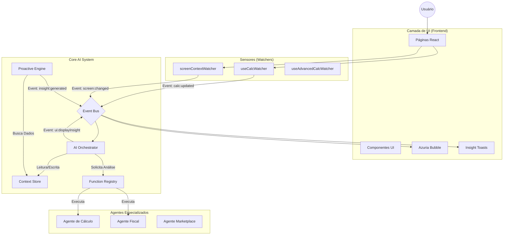

# Arquitetura do Sistema

A arquitetura do Modo Deus segue um padrão **Event-Driven** (Orientado a Eventos) com um orquestrador central.

## Diagrama Conceitual

## Descrição das Camadas

### 1. Camada de Sensores (Watchers)
Responsável por observar a aplicação React sem interferir nela. Os watchers são Hooks (`useEffect`) que monitoram estados locais e rotas.
*   **Responsabilidade:** Capturar inputs, navegação e mudanças de dados.
*   **Saída:** Eventos padronizados enviados ao Event Bus.

### 2. Event Bus
O sistema nervoso central. Desacopla os produtores de eventos (UI/Watchers) dos consumidores (AI).
*   **Padrão:** Pub/Sub tipado.
*   **Localização:** `src/azuria_ai/core/eventBus.ts`

### 3. AI Orchestrator ("O Cérebro")
Onde a mágica acontece. O orquestrador assina eventos relevantes e decide o que fazer.
*   **Funções:**
    *   Roteamento de eventos.
    *   Invocação de agentes.
    *   Geração de Insights Reativos.
    *   Coordenação de chamadas de função.

### 4. Context Store
Memória de curto prazo da IA. Mantém o estado atual da sessão do usuário.
*   **Dados:** Qual tela está ativa, últimos cálculos realizados, histórico recente.
*   **Uso:** Permite que a IA responda "analise isso" sabendo o que é "isso".

### 5. Proactive Engine
Motor autônomo que roda em loop (polling inteligente) verificando regras de negócio.
*   **Funcionamento:** A cada X segundos, avalia o Context Store contra um conjunto de regras.
*   **Saída:** Insights proativos (ex: "Sua margem caiu nos últimos 10 minutos").

### 6. Agentes e Function Registry
Definições de capacidades ("Skills") que a IA pode executar.
*   **Registro:** Lista de funções (JSON Schema) disponíveis para a LLM.
*   **Execução:** Handlers que conectam a IA a APIs reais (Fiscal, Correios, etc).

### 7. Interface de Feedback
Como a IA se comunica de volta com o usuário.
*   **InsightToast:** Notificações flutuantes não intrusivas.
*   **MiniDashboard:** Painel expandido ("Modo Deus") com chat e métricas.
